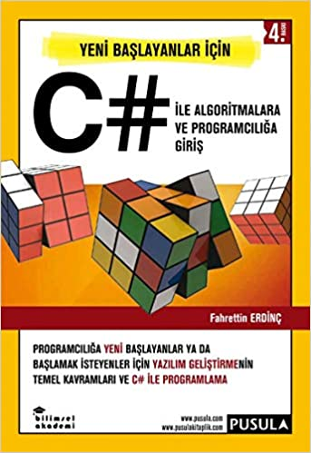

## Yeni Başlayanlar İçin C# İle Algoritmalara ve Programcılığa Giriş
Yazılıma yeni başlayanlar ve başlamak isteyenler için faydalı bir kitap, dili akıcı ve anlaşılır. İlk bitirdiğim programlama kitabıdır. Bu repo;  

* [8 .  Bölüm Döngüler](#8-bölüm-döngüler)
* [9 .  Bölüm Metotlar](#9-bölüm-metotlar)
* [11 . Bölüm Diziler](#11-bölüm-diziler)


Konu alıştırmalarının çözümü ile alakalı kodlar bulunmaktadır.



-------
# 8. Bölüm Döngüler
## Alistirma 01
> 0 ile 10 arasındaki çift sayıları konsolda alt alta yazdırınız.

```cs
    static void Main(string[] args)
    {
        for (int i = 0; i < 10; i = i + 2) // i += 2 
        {
            Console.WriteLine(i);
        }

        // sayaç birer birer de artırılabilir.
        //for (int i = 0; i < 10; i++)
        //{
        //    if (i%2 == 0) 
        //    {
        //        Console.WriteLine(i);
        //    }
        //}
        Console.ReadKey();
    }      
```  

## Alistirma 02
> 0 ile N arasındaki çift sayıları konsolda yan yana 1 sekme aralık (\t) vererek yazdırınız.

```cs
    static void Main(string[] args)
    {
        Console.Write("n değerini giriniz : ");
        string satirStr = Console.ReadLine();
        int satirInt = int.Parse(satirStr);

        for (int i = 0; i < satirInt; i = i + 2)
        {
            Console.Write($"{i} \t");
        }

        Console.ReadKey();
    }
```  

## Alistirma 03
> 0 ile N arasındaki cift sayıların toplamını bulunuz.

```cs
    static void Main(string[] args)
    {
        Console.Write("n değerini giriniz : ");
        string satir1Str = Console.ReadLine();
        int satir1Int = int.Parse(satir1Str);

        int top = 0;
        for (int i = 0; i < satir1Int; i = i + 2)
            top = top + i;

        Console.WriteLine($"0'dan N'e kadar olan çift sayıların toplamı : {top}");

        Console.WriteLine("Program sonlandı. Çıkmak için herhangi bir tuşa basınız.");
        Console.ReadKey();
    }
```  

## Alistirma 04
> 5 hariç 1 ile 10 arasındaki sayıların toplamını bulunuz.

```cs
    static void Main(string[] args)
    {
        int toplam = 0;

        for (int i= 2; i < 10; i++)
        {
            if (i == 5)
            {
                continue;
            }
            toplam = toplam + i;
        }

        Console.WriteLine($"toplanan sayilar : {toplam}");

        Console.WriteLine("Program sonlandı. Çıkmak için herhangi bir tuşa basınız.");
        Console.ReadKey();
    }
```
## Alistirma 05
> Konsoldan okunan 5 adet sayının ortalamasını bulunuz.

```cs
    static void Main(string[] args)
    {
        int toplananlar = 0;

        for (int i = 1; i <= 5; i++)
        {
            Console.Write($"{i}. sayıyı giriniz : ");
            string okunanStr = Console.ReadLine();
            int okunanInt = Convert.ToInt32(okunanStr);

            toplananlar = toplananlar + okunanInt;
            //toplananlar += okunanInt;
        }

        int ort = toplananlar / 5;
        Console.WriteLine($"sayıların ortalaması : {ort}");

        Console.WriteLine("Program sonlandı. Çıkmak için herhangi bir tuşa basınız.");
        Console.ReadKey();
    }
```

## Alistirma 06
> x = 2a-b formulunde, a ve b parametrelerinin değerlerini 1 ile 10 arasında değiştirerek, x değişkeninin alacağı değerleri konsola, x(sekme) a(sekme) b şeklinde yazdırdınız.

```cs
    static void Main(string[] args)
    {
        double x;

        for (double a = 1; a <= 10; a++)
        {
            Console.WriteLine($"\na = {a} için");
            for (double b = 1; b <= 10 ; b++)
            {
                x = 2 * a - b;
                Console.WriteLine($"a={a} \t b={b} \t x={x}");
            }
        }
        Console.WriteLine("Program sonlandı. Çıkmak için herhangi bir tuşa basınız.");
        Console.ReadKey();
    }
```

## Alistirma 07
> Bir dairenin alanını ve çevresini, yarıçapı 1 ile 10 arasındaki değerler için hesaplayınız, ve konsola yarıçap(sekme) alan(sekme) çevre(sekme) şeklinde yazdırınız.

```cs
    static void Main(string[] args)
    {
        double r, cevre, alan;
        const double pi = 3.14;

        for (r = 2; r < 10; r++)
        {
            alan = pi * r * r;
            cevre = 2 * pi * r;
            // https://bit.ly/2WVZgk7
            Console.WriteLine($"yarıçap={r,-20} \t alan={alan,-20} \t çevre={cevre,-20}");
        }
        
        Console.WriteLine("Program sonlandı. Çıkmak için herhangi bir tuşa basınız.");
        Console.ReadKey();
    }
```

## Alistirma 08
> 0 ile 100 santigrat derece arasındaki derecelerin fahrenhayt karşılıklarını konsola santigrat(sekme) fahrenhayt(sekme) şeklinde alt alta yazdırınız.

```cs
    static void Main(string[] args)
    {
        // C = (F - 32 ) / 1.8

        int C;
        double F;

        for (C = 1;  C <= 100; C++)
        {
            F = (C * 1.8) + 32;

            // https://www.csharp-examples.net/string-format-double/

            Console.WriteLine($"santigrat : {C} \t Fahrenhayt : {F:0.##}");
        }
        Console.ReadKey();
    }
```

## Alistirma 09
> Kullanıcıdan başlangıç değerini,bitiş değerini ve artış değerini alarak, başlangıç ile bitiş arasındaki sayıları konsola yazdırınız.
```cs
    static void Main(string[] args)
    {
        Console.Write("sayı kaçtan başlasın : ");
        string baslangicStr = Console.ReadLine();
        int baslangicInt = int.Parse(baslangicStr);

        Console.Write("sayı kaçla bitsin : ");
        string bitisStr = Console.ReadLine();
        int bitisInt = int.Parse(bitisStr);

        Console.Write("artış değerini giriniz : ");
        string artisStr = Console.ReadLine();
        int artisInt = int.Parse(artisStr);

        for (int i = baslangicInt; i <= bitisInt; i = i + artisInt)
        {
            Console.WriteLine(i);
        }

        Console.ReadKey();
    }
```

## Alistirma 10
> Çarpım tablosunu konsola yazdırınız.
```cs
    static void Main(string[] args)
    {
        for (int i = 1; i <= 10; i++)
        {
            Console.WriteLine($"{i}'ler Basamağı");

            // https://bit.ly/2WVZgk7
            Console.WriteLine(new String('-', 20));
            Console.WriteLine();

            for (int j = 1 ; j <= 10; j++)
            {
                Console.WriteLine($"{i} x {j} = { i * j}");
            }

            Console.WriteLine();
            Console.WriteLine(new String('*',20));
        }
        Console.ReadKey();
    }
```  
-------
# 9. Bölüm Metotlar
## Alistirma 01
> iki sayinin çarpımı yapan metodu yazınız.
```cs
    static void Main(string[] args)
    {
        Console.Write("bir sayi giriniz : ");
        string sayiStr = Console.ReadLine();
        int sayiInt = int.Parse(sayiStr);

        Console.Write("bir sayi giriniz : ");
        string sayi1Str = Console.ReadLine();
        int sayi1Int = int.Parse(sayi1Str);

        int carpilanSayilar = Carp(sayiInt, sayi1Int);

        Console.WriteLine($"{sayiInt} x {sayi1Int} = {carpilanSayilar}");

        Console.WriteLine("Program sonlandı. Çıkmak için bir tuşa basınız...");
        Console.ReadKey();

    }

    static int Carp(int x , int y)
    {
        int kare = x * y;
        return kare;
    }
```

## Alistirma 02
> Girilen iki sayının toplamını ve çarpımını dondüren metodu yazınız.
```cs
    static void Main(string[] args)
    {
        Console.Write("sayi giriniz : ");
        string sayi1Str = Console.ReadLine();
        int sayi1Int = int.Parse(sayi1Str);

        Console.Write("sayi giriniz : ");
        string sayi2Str = Console.ReadLine();
        int sayi2Int = int.Parse(sayi2Str);

        string sonuc = ToplaCarp(sayi1Int, sayi2Int);

        Console.WriteLine(sonuc);
        Console.WriteLine("Program sonlandı. Çıkmak için bir tuşa basınız...");
        Console.ReadKey();
    }
    static string ToplaCarp(int x, int y)
    {
        int top = x + y;
        int carpim = x * y;

        return $"toplam:{top} çarpım:{carpim}";
    }
```

## Alistirma 03
> Konsoldan okunan iki sayıdan büyük olanı konsola yazan metodu yazınız.

```cs
    static void Main(string[] args)
    {
        Console.Write("bir sayi giriniz : ");
        string sayi1Str = Console.ReadLine();
        int sayi1Int = Convert.ToInt32(sayi1Str);

        Console.Write("bir sayi giriniz : ");
        string sayi2Str = Console.ReadLine();
        int sayi2Int = Convert.ToInt32(sayi2Str);


        isBuyuk(sayi1Int, sayi2Int);

        Console.WriteLine("Program sonlandı. Çıkmak için bir tuşa basınız...");

        Console.ReadKey();
    }

    static void isBuyuk(int x , int y)
    {
        if (x > y)
            Console.WriteLine($"büyük sayi {x} , küçük sayi {y}");
        else
            Console.WriteLine($"büyük sayi {y} , küçük sayi {x}");
    }
```

## Alistirma 04
> Bir sayının (x) y. kuvvetini alan metodu yazınız.

```cs
    static void Main(string[] args)
    {
        Console.Write("sayi giriniz : ");
        string sayiStr = Console.ReadLine();
        int sayi = Convert.ToInt32(sayiStr);

        Console.Write("kuvvet giriniz : ");
        string kuvvetStr = Console.ReadLine();
        int kuvvet = Convert.ToInt32(kuvvetStr);

        int sayininKuvveti = KuvvetAl(sayi, kuvvet);

        Console.WriteLine($"{sayi} sayisinn {kuvvet}. kuvveti = {sayininKuvveti}");

        Console.WriteLine("Program sonlandı. Çıkmak için herhangi bir tuşa basınız.");
        Console.ReadKey();
    }
    static int KuvvetAl(int sayi , int kuvvet)
    {
        int sayininKuvveti = 1;

        for (int i = 1; i <= kuvvet; i++)
        {
            sayininKuvveti = sayininKuvveti * sayi;
        }

        return sayininKuvveti;
    }
```

## Alistirma 05
> X'in karekökünü hesaplayan metodu oluşturunuz.
```cs
    static void Main(string[] args)
    {
        Console.Write("sayi giriniz : ");
        string sayiStr = Console.ReadLine();
        int sayiInt = int.Parse(sayiStr);

        double karekokMath = KarekokMath(sayiInt);
        Console.WriteLine($"{sayiInt} sayisinin karekökü math {karekokMath}");


        double karekok = Karekok(sayiInt);
        Console.WriteLine($"{sayiInt} sayisinin karekökü {karekok}");

        Console.WriteLine("Program sonlandı. Çıkmak için herhangi bir tuşa basınız...");
        Console.ReadKey();
    }

    static double KarekokMath(int x)
    {
        double karekok = Math.Sqrt(x);
        return karekok;
    }

    static double Karekok(int x) 
    {
        //https://bit.ly/2LPtU8u

        int number = x;
        double root = 1;
        int i = 0;

        //The Babylonian Method for Computing Square Roots
        while (true)
        {
            i = i + 1;
            root = (number / root + root) / 2;
            if (i == number + 1) { break; }
        }

        return root;
    }
```

## Alistirma 06
> Konsoldan girilen bir metni konsola alt alta 10 defa yazdıran metodu yazınız.
```cs
    static void Main(string[] args)
    {
        Console.Write("bir sey yazınız : ");
        string metin = Console.ReadLine();

        yaz(metin);

        Console.WriteLine("Program sonlandı. Çıkmak için herhangi bir tuşa basınız...");
        Console.ReadKey();

    }
    static void yaz(string x)
    {
        for (int i = 1; i <= 10; i++)
        {
            Console.WriteLine($"{i}. {x}");
        }
    }
```

## Alistirma 07
> Çalıştığında çarpım tablosunu konsola yazan metodu oluşturunuz.
```cs
    static void Main(string[] args)
    {
        CarpimTablosu();
        Console.WriteLine("Program sonlandı. Çıkmak için bir tuşa basınız.");
        Console.ReadKey();
    }

    static void CarpimTablosu()
    {
        for (int i = 1; i <= 10; i++)
        {
            Console.WriteLine($"{i}'ler Basamağı");
            Console.WriteLine(new String('-',20));

            for (int j = 1; j <= 10; j++)
            {
                Console.WriteLine($"{i} x {j} = {i * j}");
            }
            Console.WriteLine(new String('*',20));
        }
    }
```

## Alistirma 08
> Kilo ile boy arasındaki fark 10 yada küçükse 'normal' daha büyükse 'fazla' değerlerini döndüren metodu yazınınız. Örneğin kişinin boyu 1.85m ve kilosu 90 ise (85-90) hesabıyla işlem yapınız.
```cs
    static void Main(string[] args)
    {
        Console.Write("kilonuzu giriniz : ");
        string kiloStr = Console.ReadLine();
        double kilo = double.Parse(kiloStr);

        Console.Write("boyunuzu giriniz : ");
        string boyStr = Console.ReadLine();
        double boy = double.Parse(boyStr);

        double cm = boy * 100;
        boy = cm - 100;

        string oran = KiloBoyHesabi(kilo, boy);

        Console.WriteLine(oran);
        Console.ReadKey();
    }

    static string KiloBoyHesabi(double kilo , double boy)
    {
        if (kilo - boy <= 10 && kilo - boy > 0 || boy - kilo <= 10 && boy - kilo > 0)
        {
            return "normal";
        }
        else
        {
            return "fazla";
        }
    }
```

## Alistirma 09
> Taban uzunluğu ve yüksekliği verilen bir üçgenin alanını hesaplayan bir metot yazınız.
```cs
    static void Main(string[] args)
    {
        Console.Write("üçgenin tabanını giriniz : ");
        string tabanStr = Console.ReadLine();
        int taban = int.Parse(tabanStr);

        Console.Write("üçgenin yüksekliğini giriniz : ");
        string yukseklikStr = Console.ReadLine();
        int yukseklik = int.Parse(yukseklikStr);

        int alan = AlanHesapla(taban, yukseklik);

        Console.WriteLine($"taban = {taban} , yükseklik = {yukseklik} , üçgenin alanı = {alan}");

        Console.WriteLine("Program sonlandı. Çıkmak için bir tuşa basınız...");
        Console.ReadKey();

    }
    static int AlanHesapla(int taban , int yukseklik)
    {
        int alan = (taban * yukseklik) / 2;
        return alan;
    }
```

## Alistirma 10
> Yarıçapı verilen bir çemberin alanını hesaplayan bir metot yazınız.
```cs
    static void Main(string[] args)
    {
        Console.Write("çemberin yarıçapını giriniz: ");
        string yarıcapStr = Console.ReadLine();
        double yarıcap = int.Parse(yarıcapStr);

        double alan = AlanHesapla(yarıcap);

        Console.WriteLine($"çemberin alanı = {alan}");

        Console.WriteLine("Program sonlandı. Çıkmak için bir tusa basınız.");
        Console.ReadKey();
    }
    static double AlanHesapla(double yarıcap)
    { 
        return Math.PI * yarıcap * yarıcap;
    }
```

## Alistirma 11
> Girilen bir kelimenin uzunluğunu bulan metodu yazınız.
```cs
    static void Main(string[] args)
    {
        Console.Write("bir şey yazınız : ");
        string metin = Console.ReadLine();

        // kelimenin başında ve sonundaki boslukları Trim fonksiyonu siler.
        metin = metin.Trim();

        int uzunluk = KelimeUzunluk(metin);

        Console.WriteLine($"{metin} kelimenin uzunlugu {uzunluk}");

        Console.WriteLine("Program sonlandı.");
        Console.ReadKey();
    }
    static int KelimeUzunluk(string kelime)
    {
        int uzunluk = kelime.Length;
        return uzunluk;
    }
```

## Alistirma 12
> Çarpma işlemini toplama kullanarak yapan metodu yazınız.
```cs
    static void Main(string[] args)
    {
        Console.Write("birinci sayıyı giriniz: ");
        string num1Str = Console.ReadLine();
        int num1 = int.Parse(num1Str);

        Console.Write("ikinci sayıyı giriniz: ");
        string num2Str = Console.ReadLine();
        int num2 = int.Parse(num2Str);

        int sonuc = Carp(num1, num2);

        Console.WriteLine($"iki sayinin toplama ile metod ile yapımı {sonuc}");

        Console.WriteLine("Program sonlandı.");
        Console.ReadKey();
    }
    static int Carp(int num1 , int num2)
    {
        int top = 0;

        for (int i = 1; i <= num2 ; i++)
        {
            top = top + num1;
        }

        return top;
    }
```

-------
# 11. Bölüm Diziler 
## Alistirma 01
> FB ve GS isimli 11 elemanlı iki string dizi oluşturun. Daha sonra, her iki dizinin elemanlarını konsoldan alın. Fenerbahce ve Galatasaray takımlarının ilk 11'ini öğrenin ve gerçek isimlerini girin. Son olarak, her iki dizinin elemanlarını yani yan yan yazdırın.

```cs
    static void Main(string[] args)
    {
        Console.WriteLine("Galatasaray futbol takımı isim giriniz!..");
        string[] galatasaray = new string[11];

        for (int i = 0; i < galatasaray.Length; i++)
        {
            Console.Write($"{i+1:D2}. ismi giriniz: ");
            galatasaray[i] = Console.ReadLine();
        }

        Console.WriteLine();

        Console.WriteLine("Fenerbahce futbol takımı isim giriniz!..");
        string[] fenerbahce = new string[11];

        for (int i = 0; i < fenerbahce.Length; i++)
        {
            Console.Write($"{i + 1:D2}. ismi giriniz: ");
            fenerbahce[i] = Console.ReadLine();
        }

        Console.WriteLine("{0,-20} {1,-20} {2,-20}","Numarası","Galatasaray","Fenerbahce");

        for (int i = 0; i < 10; i++)
        {
            Console.WriteLine("{0,-20} {1,-20} {2,-21}", $"{i+1:D2}. futbolcu" , galatasaray[i], fenerbahce[i]);
        }

        Console.ReadKey();
    }
```

## Alistirma 02
> 10 kişilik bir sınıfta okuyan öğrencilerin yılsonu notlarını konsoldan okuyun. Notların ortalamasını bulun ve konsola yazdırın.

```cs
    static void Main(string[] args)
    {
        int[] ogrencilernotu = new int[10];

        for (int i = 0; i < 10; i++)
        {
            Console.Write($"{i+1}. öğrencinin yılsonu notu: ");
            string notlarStr = Console.ReadLine();
            ogrencilernotu[i] = Convert.ToInt32(notlarStr);
            
            if (ogrencilernotu[i] > 100 || ogrencilernotu[i] < 0)
            {
                Console.WriteLine("Hatalı not girdiniz!!!!");
                i--;
                continue;
            }
        }

        double ort = OrtalamaBul(ogrencilernotu);
        Console.WriteLine($"10 öğrencinin yılsonu notu ortalaması: {ort}");

        Console.ReadKey();
    }
    static double OrtalamaBul(int[] dizi)
    {
        double top = 0;
        for (int i = 0; i < dizi.Length; i++)
        {
            top = top + dizi[i];
        }

        double ort = top / dizi.Length;
        return ort;
    }
```

## Alistirma 03
> Yukarıdaki öğrencilerin en küçük ve en büyük notlarını bulup konsola yazınız.
```cs
    static void Main(string[] args)
    {
        int[] ogrencilernotu = new int[10];

        for (int i = 0; i < 10; i++)
        {
            Console.Write($"{i + 1}. öğrencinin yılsonu notu: ");
            string notlarStr = Console.ReadLine();
            ogrencilernotu[i] = Convert.ToInt32(notlarStr);

            if (ogrencilernotu[i] > 100 || ogrencilernotu[i] < 0)
            {
                Console.WriteLine("Hatalı not girdiniz!!!!");
                i--;
                continue;
            }
        }

        int min = MinValue(ogrencilernotu);
        int max = MaxValue(ogrencilernotu);
        Console.WriteLine($"buyuk sayi: {max} - kucuk sayi: {min}");

        double ort = OrtalamaBul(ogrencilernotu);
        Console.WriteLine($"10 öğrencinin yılsonu notu ortalaması: {ort}");

        Console.ReadKey();
    }
    static double OrtalamaBul(int[] dizi)
    {
        double top = 0;
        for (int i = 0; i < dizi.Length; i++)
        {
            top = top + dizi[i];
        }

        double ort = top / dizi.Length;
        return ort;
    }
    static int MinValue(int[] dizi)
    {
        //int min = 0; // yanlış
        int min = int.MaxValue;
        // int min = dizi[0];
        for (int i = 0; i < dizi.Length; i++)
        {
            if (min > dizi[i])
            {
                min = dizi[i];
            }

        }
        return min;
    }
    static int MaxValue(int[] dizi)
    {
        //int max = 0; // yanlış
        // int max = int.MinValue;
        int max = dizi[0];

        for (int i = 0; i < dizi.Length; i++)
        {
            if (dizi[i] > max)
            {
                max = dizi[i];
            }
        }
        return max;
    }  
```

## Alistirma 04
> Milli Piyango çekilişi için, 0 ile 9 arasında rastgele 6 rakam gerekmektedir. Rastgele 6 adet rakam elde edin ve 6 elemanlı diziye aktarın. Son olarak da dizi elemanlarını konsola yazdırın.
```cs
    static void Main(string[] args)
    {
        Random rnd = new Random();         
        int[] sayilar = new int[6];

        for (int i = 0; i < sayilar.Length; i++)
        {
            int rndNum = rnd.Next(0, 9);
            sayilar[i] = rndNum;           
        }

        Console.Write("6 rakamlı rastgele piyango: ");
        for (int i = 0; i < sayilar.Length; i++)
        {
            Console.Write(sayilar[i]);
        }           
        Console.ReadKey();
    }
```

## Alistirma 05
> Bir zar 100 defa atılmaktadır. Hangi değerlerin kaç defa geldiğini dizi kullanarak bir program yazınız.

```cs
    static void Main(string[] args)
    {
        Random rnd = new Random();

        int[] zarDegerleri = new int[100];

        // Zar Değerlerin içine 1 den 7 e kadar 100 tane random sayi atacak.
        for (int i = 0; i < zarDegerleri.Length; i++)
        {
            int rndNum = rnd.Next(1, 7);
            zarDegerleri[i] = rndNum;
        }

        for (int i = 1; i <= 6; i++)
        {
            int kacTane = KacTaneVar(zarDegerleri, i);
            Console.WriteLine($"{i} sayisindan {kacTane} tane var");
        }

        Console.ReadKey();
    }

    //paremetre olarak aldığı dizi içinde kaç tane sayi oldugunu bulacak.
    static int KacTaneVar(int [] dizi, int sayi)
    {
        int sayac = 0;

        for (int i = 0; i < dizi.Length; i++)
        {
            if (sayi == dizi[i])
            {
                sayac++;
            } 
        }                  

        return sayac;
    } 
```

## Alistirma 06
> 10 kişilik bir sınıfta, her öğrencinin adını ve ders notunu okuyan iki boyutlu bir dizi oluşturun. Daha sonra da, isim ve ders notlarını konsola yazdırın.
```cs
    static void Main(string[] args)
    {
        // 10 satır, 2 sütun iki boylu dizi
        string[,] bilgiler = new string[10, 2];
        int sira = 1;

        for (int i = 0; i < 10; i++) 
        {
            Console.WriteLine($"{sira++}. Öğrenci Adını Giriniz: ");
            string ad = Console.ReadLine();

            Console.WriteLine("Öğrenci Notunu Giriniz: ");
            string not = Console.ReadLine();

            bilgiler[i, 0] = ad;
            bilgiler[i, 1] = not;

        }

        Console.WriteLine(new String('=', 65));
        Console.WriteLine("{0,30} {1,30}", "Öğrenci İsimleri", "Öğrenci Notları");

        for (int i = 0; i < 10; i++)
        {
            string ad = bilgiler[i, 0];
            string not = bilgiler[i, 1];
            int siraNo = i + 1;
            Console.WriteLine("{0,-20} {1,-30} {2,-30}", $"{siraNo:D2}. öğrenci", ad, not);
        }


        Console.ReadKey();
    }
```

## Alistirma 07
> Bir önceki alıştırmadaki öğrencilerin, aldığı en büyük notu bulun ve öğrencinin adını konsola yazdırın.
```cs
    static void Main(string[] args)
    {
        string[,] sinif = new string[10, 2];
        int sira = 1;

        for (int i = 0; i < 10; i++)
        {
            Console.Write($"{sira++}. Öğrenci Adını Giriniz: ");
            string ad = Console.ReadLine();

            Console.Write("Öğrenci Notunu Giriniz: ");
            string not = Console.ReadLine();

            sinif[i, 0] = ad;
            sinif[i, 1] = not;
        }

        Console.WriteLine(new String('=', 65));
        Console.WriteLine("{0,30} {1,30}", "Öğrenci İsimleri", "Öğrenci Notları");

        for (int i = 0; i < 10; i++)
        {
            string ad = sinif[i, 0];
            string not = sinif[i, 1];
            int siraNo = i + 1; 
            Console.WriteLine("{0,-20} {1,-30} {2,-30}", $"{siraNo:D2}. öğrenci", ad, not);
        }

        int index = MaxValueIndex(sinif);
        string maxAd = sinif[index, 0];
        string maxNot = sinif[index, 1];

        Console.WriteLine($"En Yüksek Notu Alan Öğrenci: {maxAd}");
        Console.WriteLine($"Öğrencinin Notu: {maxNot}");
        Console.WriteLine("Tebrikler!!!!!!!");

        Console.ReadKey();
    }
    /// <summary>
    /// Fonkisyon en büyük değerin indeksini dönecek.
    /// En büyük puanı almış öğrenciyi bulacak.
    /// Bulunan öğrencinin satır indeksini dönecek.
    /// </summary>
    /// <param name="bilgiler"> iki boyutlu dizi alacak 0. indeks adı, 1. indeks öğrencinin notu</param>
    /// <returns></returns>
    static int MaxValueIndex(string[,] bilgiler)
    {
        int maxNot = int.MinValue;
        int maxIndex = 0;

        for (int i = 0; i < 10; i++)
        {
            string notStr = bilgiler[i, 1];
            int not = Convert.ToInt32(notStr);

            if (not > maxNot)
            {
                maxNot = not;
                maxIndex = i;
            }
        }

        return maxIndex;
    }
```

## Alistirma 08
> Üç satırlı ve iki sütunlu, a ve b isimli iki matris oluşturun. Matrislerin değerlerini konsoldan okutun ve bu matrislerin çarpımını konsola yazdırın.
```cs
    static void Main(string[] args)
    {
        // 3 satırlı ve iki sütünlu a ve b matrisi
        int[,] aMatris = new int[3, 2];
        int[,] bMatris = new int[3, 2];

        // a matrisi doldur
        BaslikYaz("A Matrisi Değerlerini Giriniz");
        MatrisDoldur(aMatris);

        // b matrisi doldur
        BaslikYaz("B Matrisi Değerlerini Giriniz");
        MatrisDoldur(bMatris);

        // a ve b matrikslerini çarp
        int[,] sonuc = CarpMatris(aMatris, bMatris);

        // sonuçları ekrana yaz
        //// a matriksini yaz
        BaslikYaz("A Matrisi");
        MatrisYaz(aMatris);

        //// b matriksini yaz
        BaslikYaz("B Matrisi");
        MatrisYaz(bMatris);

        //// iki matriksin çarpımını yaz
        BaslikYaz("Sonuc Matrisi");
        MatrisYaz(sonuc);

        Console.WriteLine("Program sonlandı, çıkmak için herhangi bir tuşa basınız!..");
        Console.ReadKey();
    }
    static void MatrisDoldur(int[,] Matris)
    {
        for (int i = 0; i < 3; i++) // satir
        {
            for (int j = 0; j < 2; j++) // sütün
            {
                Console.Write($"{i}. elemanın {j}. Değerini Giriniz: ");
                string degerStr = Console.ReadLine();
                int deger = Convert.ToInt32(degerStr);
                Matris[i, j] = deger;
            }
        }
    }

    static int[,] CarpMatris(int[,] aMatris , int[,] bMatris)
    {
        int[,] sonuc = new int[3, 2];

        for (int i = 0; i < 3; i++)
        {
            for (int j = 0; j < 2; j++)
            {
                sonuc[i, j] = aMatris[i, j] * bMatris[i, j];
            }
        }
        return sonuc;
    }

    static void MatrisYaz(int[,] Matris)
    {         
        for (int i = 0; i < 3; i++)
        {
            for (int j = 0; j < 2; j++)
            {
                int deger = Matris[i,j];

                Console.Write($"{deger,-10} ");
            }
            Console.WriteLine();
        }
    }
    static void BaslikYaz(string yazı)
    {
        Console.WriteLine(new string('-', 50));
        Console.WriteLine("# {0}", yazı);
        Console.WriteLine(new string('-', 50));
    }
```

